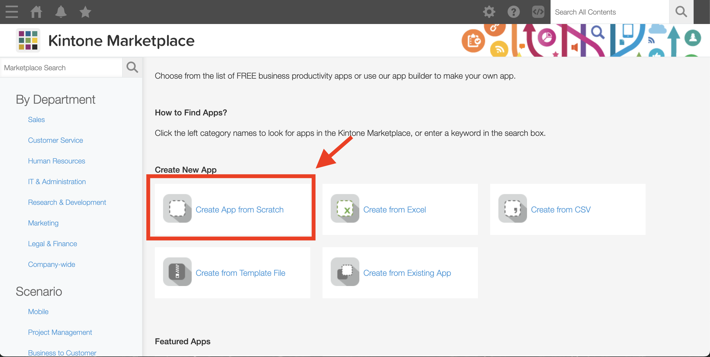
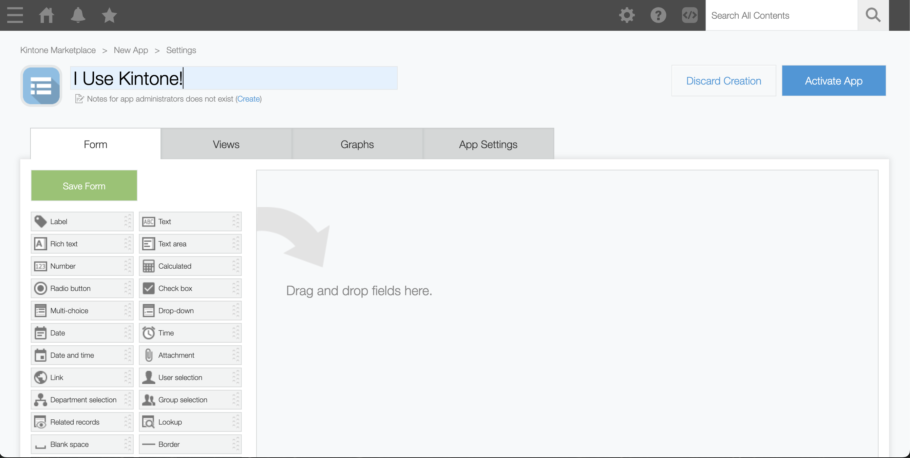
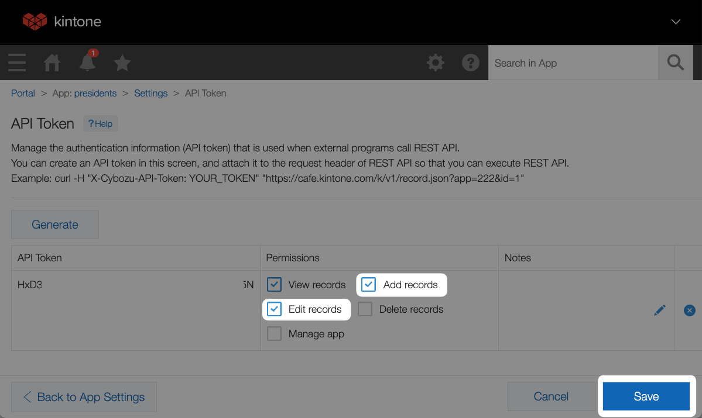
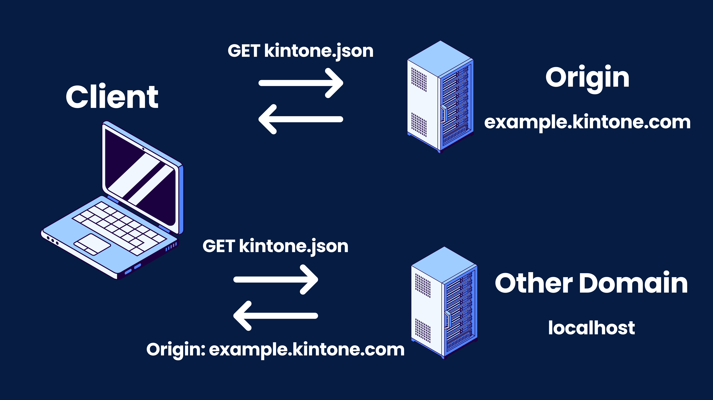

# Workshop Steps
This guide outlines all the steps required to complete the workshop.

## Outline <!-- omit in toc -->
* [A. Get started - clone the repo \& install dependencies](#a-get-started---clone-the-repo--install-dependencies)
  * [Terminal 1](#terminal-1)
  * [Terminal 2](#terminal-2)
* [B. Get your free Kintone database](#b-get-your-free-kintone-database)
* [C. Create a `.env` file](#c-create-a-env-file)
* [D. Create a Kintone web database app](#d-create-a-kintone-web-database-app)
  * [Input Fields](#input-fields)
  * [Steps to create the Kintone App](#steps-to-create-the-kintone-app)
* [E. Generate an API token for the Kintone app](#e-generate-an-api-token-for-the-kintone-app)
* [H. Edit server.js](#h-edit-serverjs)
  * [What do you mean, CORS?](#what-do-you-mean-cors)
  * [Overview](#overview)
  * [server.js setup](#serverjs-setup)
  * [Let's Start Coding!](#lets-start-coding)
* [I. Start the servers](#i-start-the-servers)
  * [Terminal 1 - Frontend](#terminal-1---frontend)
  * [Terminal 2 - Backend](#terminal-2---backend)
* [Check your work](#check-your-work)
* [Still got a problem?](#still-got-a-problem)

## A. Get started - clone the repo & install dependencies

First, clone the [kintone-workshops/React-x-REST-API-Workshop](https://github.com/kintone-workshops/React-x-REST-API-Workshop) repo!  🚀  
Then go inside the folders & install the dependencies!

⚡ Two terminal windows are required for this workshop.

### Terminal 1

```shell
cd Downloads

git clone https://github.com/kintone-workshops/React-x-REST-API-Workshop

cd React-x-REST-API-Workshop

npm install
```

### Terminal 2

```shell
cd Downloads/React-x-REST-API-Workshop

cd backend && npm install
```

### ⚠️ WARNING ⚠️ <!-- omit in toc -->
⚡ **Node.js v18.16.1** or higher is required to run this workshop.  
(The current LTS version is recommended)

Not the correct versions, or confused? 🤔 → Check out the [Guide on Installing Node.js & npm {macOS & Windows}](https://dev.to/kintonedevprogram/guide-on-installing-nodejs-npm-macos-windows-16ii).

## B. Get your free Kintone database

1. Go to [kintone.dev/new/](http://kintone.dev/new/) and fill out the form.  
    * ⚡ Only use lowercase, numbers, & hyphens in your subdomain
    * ⚠ Do not use uppercase or special characters
    * 🤖 Example subdomain: `example`
    * ✅ Use Chrome or Firefox
    * ❌ Do not use Safari
2. Look for "**Welcome to Kintone! One More Step for Developer License**" email in your inbox and click the **Activate Now** button.
    * Sent from `developer@kintone.com`
    * If you don't see it, check your spam folder
3. Set the **Initial Password**
4. Log into your Kintone Subdomain
    * URL: {your subdomain}.kintone.com (e.g. `example.kintone.com`)
    * Login Name: Your email address
    * Password: The password you set in Step 3
    * ⚡ If you forget your password, you can reset it by clicking the **Having Trouble Logging In?** link on the login screen.

|                                                                                                            |                                                                                                                              |
| ---------------------------------------------------------------------------------------------------------- | ---------------------------------------------------------------------------------------------------------------------------- |
|          |  |
|  |                                                               |

## C. Create a `.env` file

Duplicate the [.env.example](./../.env.example) file and save as `.env` file.  
This is where we will be saving the login credentials and API Keys.

Here is what your `.env` might look like:

```txt
SUBDOMAIN = "example"
APPID = "1"
APITOKEN = "1J22qNAR54I4eiMcd0JmfDAavJNfNJDVaqt34X9A"
```

So far, you can fill out the following variables:
* `SUBDOMAIN`

### ⚠️ WARNING ⚠️ <!-- omit in toc -->

⚠️ DO NOT DELETE THE [.env.example](./../.env.example) FILE!  
[.env.example](./../.env.example) is used by env-cmd to verify that the `.env` file is correctly configured.

## D. Create a Kintone web database app

Let's create a Kintone App to store Kintone User's Country, State, and City.  

Here are the required fields & their configurations for our workshop:

### Input Fields

| Field Type    | Field Name  | Field Code |
| ------------- | ----------- | ---------- |
| Text Field #1 | **Country** | `country`  |
| Text Field #2 | **State**   | `state`    |
| Text Field #3 | **City**    | `city`     |

### Steps to create the Kintone App

To create the Kintone App, click the **➕** button on the upper right side of the Kintone Portal.  


Click the **Create App from Scratch** button.  


Name your App. We chose **I Use Kintone!**  


Configure your App to have three Text Fields, with field codes for `country`, `state`, and `city`.  


Then, click the **Save** and **Activate App** buttons! 💪  

_Confused? 🤔 → Check out the [How to Create a Kintone Database App](https://youtu.be/pRtfn-8cf_I) video 📺_

## E. Generate an API token for the Kintone app

We need to generate an API Token for our Kintone App.

1. From the Kintone App, click the **App Settings** button ⚙️ on the upper right side.
    * 
1. Select the **App Settings** tab
1. Under **Customization and Integration**, click the **API Token** button.
1. Click **Generate**. 
1. Check the `Add records` and `Edit records` boxes.  
    * 
1. Copy the API Token and paste it to the `APITOKEN` variable in your `.env` file.
1. Click the **Save** button on the bottom right side of the screen.
1. Click the **Update App** button on the upper right side of the screen.


### Update the `.env` file with the App ID as well! <!-- omit in toc -->
Input the App ID into the `APPID` variable in your `.env` file.

If this is NOT your first Kintone App, then you need to update the `"app"` variable with your App ID!

The App ID number can be easily found in the Kintone App's URL!

Go to the Kintone App and grab the URL.  
* Example: `https://devevents.kintone.com/k/52/`

Kintone App's URL follows this template:  
* `https://<SUBDOMAIN>.kintone.com/k/<App ID>/show#record=<RECORD ID>`

So then the `https://devevents.kintone.com/k/52/` URL tells us that this App's ID is `52`

---

## H. Edit server.js

For this workshop, we will only be coding in [./src/backend/server.js](../src/backend/server.js).
This tutorial is focused only on connecting a React frontend to a Kintone Web Database. As such, we won't be covering the front end components (located at [./src/App.js](../src/App.js)).

As is common for Web Development, API calls from the frontend directly to your Kintone Database are not allowed, due to CORS security risks.

### What do you mean, CORS?

Since our frontend resides on localhost:3000 and any API calls to our Kintone Database would be directed at your Kintone subdomain, a backend is needed to act as a proxy.


By configuring CORS settings on our Express Server backend, we can make REST API requests to our Kintone Web Database.

### Overview

In short, our React Frontend, located on `localhost:3000` will make a fetch request of either `GET` or `POST` to our Express Server at `localhost:50000/getData` or `localhost:50000/postData`. Then, acting as our proxy, our backend will then make a fetch request to `https://example.kintone.com/k/v1/record.json?app=1`, to either GET or POST our data. The data will be returned our backend as JSON, which we will then pass back to the frontend to be displayed.

### server.js setup

Navigate to [./src/backend/server.js](../src/backend/server.js).

At the top of the file, we have our dependency imports and class instantiation:

``` javascript
const express = require('express');
const cors = require('cors');
const PORT = 50000;
const app = express();
```

Next, we have our authentication setup via our `.env` file:

``` javascript
require('dotenv').config({path: '../.env'});
const subdomain = process.env.SUBDOMAIN;
const appID = process.env.APPID;
const apiToken = process.env.APITOKEN;
```

And lastly, we have some CORS configuration:

```javascript
app.use(cors());
const corsOptions = {
  origin: 'http://localhost:3000'
};
```

and some pre-configured REST API endpoints:

```javascript
const multipleRecordsEndpoint = `https://${subdomain}.kintone.com/k/v1/records.json?app=${appID}`
const singleRecordEndpoint = `https://${subdomain}.kintone.com/k/v1/record.json?app=${appID}`;
```

We got this information from our [Kintone Developer Program](https://kintone.dev/en/) website, specifically from our [REST API Records](https://kintone.dev/en/docs/kintone/rest-api/records/) documentation.

### Let's Start Coding!

We've instantiated our Express Server as `app`, so let's first make a `GET` request route on `localhost:50000/getData`.

```javascript
app.get('/getData', cors(corsOptions), async (req, res) => {
// configure here
});
```

Express Server routes look and function much like functions. We specify this is a `GET` request route with `app.get()`, and then fill in the route name, and its CORS options. Because it is a function, we can designate it as asynchronous easily. One point to note, is how Express Servers designated return values.

You may have noticed that `(req, res)` specifies a request object (normal), **and** and response object. (Not exactly normal!) Normally in a function, responses are handled via `return` statements. This is specific to Express, so be careful.

Thankfully, the rest of routing with Express is simple `fetch` requests.

```javascript
app.get('/getData', cors(corsOptions), async (req, res) => {
  const fetchOptions = {
    method: 'GET',
    headers: {
      'X-Cybozu-API-Token': apiToken
    }
  }
  const response = await fetch(multipleRecordsEndpoint, fetchOptions);
  const jsonResponse = await response.json();
});
```

Like a normal `fetch` request, we designate some options and our headers with our API Token.
Designate a new constant variable `response` and set it equal to the result of awaiting a `fetch` request to `multipleRecordsEndpoint`. This is a `GET` request, so when we **GET** our database records, we want to see **all** records in the database. Therefore, we are fetching from `records.json`.

Lastly, another Express Server quirk, we designate our JSON response (which gets sent back to our frontend) like so:

```javascript
// This route executes when a GET request lands on localhost:50000/getData
app.get('/getData', cors(corsOptions), async (req, res) => {
  const fetchOptions = {
    method: 'GET',
    headers: {
      'X-Cybozu-API-Token': apiToken
    }
  }
  const response = await fetch(multipleRecordsEndpoint, fetchOptions);
  const jsonResponse = await response.json();
  res.json(jsonResponse);
});
```

With this, restart your Express Server, and from your React frontend click the `Get!` button. If you have any data in your database, it should be displayed on the page. If the loading spinner never stops, check developer options with `F12` for errors, and reference the [Debugging](../README.md#debugging) section.

Last, we'll code out the `POST` route. It's similar, however we need to correctly structure our `POST BODY` data, so it can be saved to Kintone properly.

```javascript
app.post('/postData', cors(corsOptions), async (req, res) => {

});
```

This time, specify `app.post`, with an endpoint of `/postData`. Express Server makes it easy to create different routes.

Next, we'll structure our data to save to Kintone.
Looking at our frontend, we can see that the submit button in [App.js](../src/App.js) sends a `location` object with properties of `country`, `state`, and `city`. For this tutorial, we've handled the frontend so we can focus on the backend.

According to the [Kintone REST API documentation](https://kintone.dev/en/docs/kintone/rest-api/records/add-record/#sample-request) our `requestBody` should be formatted as so:

```javascript
app.post('/postData', cors(corsOptions), async (req, res) => {
  const requestBody = {
    'app': appID,
    'record': {
      'country': {
        'value': req.body.country
      },
      'state': {
        'value': req.body.state
      },
      'city': {
        'value': req.body.city
      }
    }
  };
});
```

We then put our `requestBody` in our `options` for `fetch`, and make a request to the `singleRecordEndpoint`, as we only wish to save one location at a time to our Kintone Database.

```javascript
app.post('/postData', cors(corsOptions), async (req, res) => {
  const requestBody = {
    'app': appID,
    'record': {
      'country': {
        'value': req.body.country
      },
      'state': {
        'value': req.body.state
      },
      'city': {
        'value': req.body.city
      }
    }
  };
  const options = {
    method: 'POST',
    headers: {
      'X-Cybozu-API-Token': apiToken,
      'Content-Type': 'application/json',
    },
    body: JSON.stringify(requestBody)
  }
  const response = await fetch(singleRecordEndpoint, options);
  const jsonResponse = await response.json();
  res.json(jsonResponse);
});
```

---

## I. Start the servers

Open two terminal windows

### Terminal 1 - Frontend

```shell
cd React-x-REST-API-Workshop

npm run start
```

### Terminal 2 - Backend

```shell
cd React-x-REST-API-Workshop/backend

npm run start
```

Navigate to [`localhost:3000`](http://localhost:3000/) in your browser, enter your Country, State, and City, and click `submit`!  
If your entry appears in your Kintone Database, then congratulations, you did it!

## Check your work

Is your code not working?

Compare your [./src/backend/server.js](../src/backend/server.js) with the [Solution_server.js](./Solution_server.js) to see if it is all written correctly.

## Still got a problem?

Check out README's [Debugging](../README.md#debugging) section!

And finally, post your Kintone customization questions over at our community forum:  
[forum.kintone.dev](https://forum.kintone.dev/)

Good luck coding! 💪
